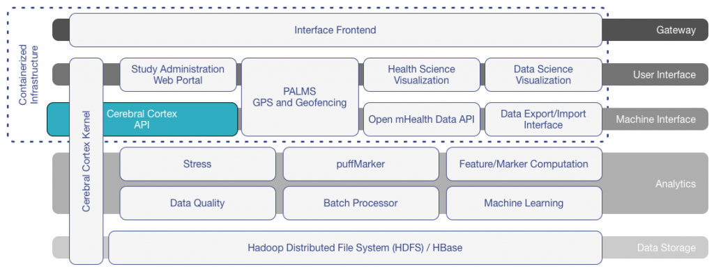

# Cerebral Cortex
**designed to facilitate mobile health data analytics and interventions**

<!--  -->

It brings state-of-the-art research techniques and methodologies
together in a single system to affect clinical outcomes with adaptable,
just-in-time interventions delivered to participants in the field.

## Functionality and Architecture of Cerebral Cortex

Cerebral Cortex is a flexible layered architecture designed around different functional layers so that each component can be adapted and extended without adversely affecting the other components.  A Kernel links the layers to provide security controls between modules and a unified data interface to abstract implementation specifics. To meet future needs, we anticipate continuing to adapt and augment the Cerebral Cortex platform to support future technologies and the needs of new studies. Cerebral Cortex has the following layers and associated modules:

## Gateway
A gateway layer operates in front of all the other layers to provide secure interfaces and APIs for interfacing with the platform.  This currently includes maintaining HTTP over SSL and routing requests to the appropriate internal platforms.

## User interfaces
The user interface layer is currently composed of four core applications:

* A **study administration web portal** which provides a secure and encrypted interface that allows study coordinators to conduct, configure, and monitor field studies with mCerebrum.
* **Personal Activity and Location Measurement System** (PALMS) that is designed to process GPS information and produce features based on physical activity and location. It also provides a set of APIs on which other applications can utilizes its functionality.
* A **health science visualization** through our Discovery Dashboard provides data visualizations designed for the health community, which aid in data interpretation by transforming the high-frequency sensor data streams into key digital biomarkers.
* A **data science visualization** complements Discovery Dashboard by providing a mechanism for inspecting multiple high-frequency data streams.

## Machine interfaces
A set of machine interfaces complements the UI by providing several different APIs for both Cerebral Cortex’s internal applications and as an interface to external web services and other data sources.

* The **Cerebral Cortex API** is designed to work in conjunction with the kernel to provide an interface for external applications such as mCerebrum to produce and consume data from the system. This is the primary interface on which our high-frequency data streams arrive from mCerebrum.
* The **Open mHealth APIs** provide a translation layer between our internal data storage system and their schemas. This allows Cerebral Cortex to pull in data from supported external web services and provide certain MD2K data streams as outputs.
* A **data import and export** module is designed to translate high-frequency data streams into commonly usable formats for use by health and data science researchers. It will also support inserting data into Cerebral Cortex from these same formats.

Both the user and machine interfaces are built around a rapidly deployable containerized platform (Docker) to support a more flexible set of deployments across multiple different cloud architectures.

## Analytics
The analytics layer contains modules primarily designed around the Apache Spark toolchain to run algorithm on the population-scale data sets that Cerebral Cortex contains.  Many processes parallel what is computed in mCerebrum and extends the analysis to examine data at larger time resolutions (e.g., processing the entire day’s worth of data for better estimate of baseline physiology rather than relying on history for online computation in mCerebrum) for higher accuracy and for population scale analytics. Described are several modules within the system.

* **Stress** is a cloud implementation of the cStress research and is designed to run on an entire person’s data instead of the real-time implementation on mCerebrum.
* **puffMarker** the cloud implementation of the puffMarker research where it can also look at an entire person’s dataset.
* **Feature/Marker computation** contains additional feature and marker computations that support research or models and generally do not fit into specific algorithms.
* The **data quality** module is designed to determine the effectiveness (i.e., yield) of collected data streams and provides a classification of potential problems and errors. This module is designed to aid in diagnosing data failures in the mCerebrum platform.
* A **batch processor** provides a mechanism to read data from HBase and run algorithms on it without worrying about writing specialized distributed processing code.
* **Machine learning** support multiple libraries include Scikit-learn and Spark’s MLlib. The ultimate goal for machine learning is to interoperate with the Discover Dashboard to provide an interactive interface on which various machine learning techniques can quickly be evaluated and tunes. Models learned on population-scale data can be sent back to a smartphone in the field to improve detection and classification accuracy.

## Data Storage
Data storage is currently provided by a combination of the Apache Hadoop Distributed File System (HDFS) and HBase, a distributed bigtable datastore. HBase is responsible for storing the vast majority of the high-frequency time series data streams and provides a queryable interface that integrates well with the analytics layer tools.
